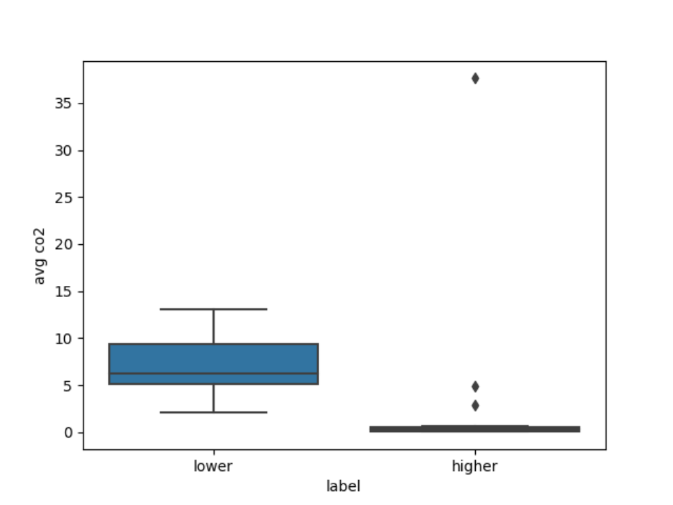

# 2021Fall_finals

## Title: *Finding countries that contributed and are impacted by global warming*

###  Team Member: 
    - Tiffany Kim (tiffkim)
    - Bo Jia (Scott-Jia)

###  Overview:
Past decades, we have witnessed many unusual "record breaking" natural disasters that not only destroyed our habitats, but also the habitats of other species. Scientists have proved the link between greenhouse gas and global warming. Humans are responsible for the cause of global warming and we are witnessing the impact through [climate change](https://stacker.com/stories/3377/natural-disasters-linked-climate-change). We hear news that some countries are [sinking](https://www.activesustainability.com/climate-change/countries-risk-disappearing-climate-change/?_adin=02021864894) and some of us are experiencing the magnitude of global warming more than others. Based on general news we see, the countries who are most impacted by global warming does not seemed to be the ones who were most responsible for it. We wanted to investigate which countries are most responsible for global warming and see if the most responsible ones are experiencing the temeperature increase.

With our research background, we have developed two hypotheses to test using the data analysis.
### Hypothesis
Hypothesis #1: Countries closer to the equator experience higher average temperature increase than the countries 
farther from the equator in the past 50 years.  (In percentage )
Datasets needed: latitude and longitude library, country map, country temperatures
The idea behind looking at the countries closer to the equator is the nature of high temperature in those areas. Since they are closest to the sun, they would see the impact of temerpature rising quicker and more than countries further away from the equator.

Hypothesis #2: Countries with ascending GDP and population have growing CO2 emission per capita than
countries with descending GDP and population.
Datasets needed: GDP, population, CO2 emission by countries
The motif behind this hypothesis is the idea of [developing countries vs. developed countries](https://keydifferences.com/difference-between-developed-countries-and-developing-countries.html). Since developed countries have access to personal automobiles and have higher standards of living in general, I thought developed countries would emit more CO2 compared to the developing countries per capita.

### Data Sets
Datasets for hypothesis #1
- [temperature data by year and city](https://www.kaggle.com/berkeleyearth/climate-change-earth-surface-temperature-data?select=GlobalLandTemperaturesByCity.csv)

- [city locations with ASCII name](https://www.kaggle.com/swapnilbhange/average-temperature-of-cities)

Datasets for hypothesis #2
- [world GDP growth by country in percentage](https://data.worldbank.org/indicator/NY.GDP.MKTP.KD.ZG?end=2020&start=1961&view=chart)

- [world Population by country](https://population.un.org/wpp/Download/Standard/Population/)

- [Per capita CO2 emissions](https://ourworldindata.org/per-capita-co2)

## Data analysis
### Hypothesis #1
Some of the challenges occurred during the data analysis...
During the analysis, I meet some problems. First, for the data sets i got, the format is not very structured, I should convert the country name to ascii name. also, to extract month and year information from the date, also utilize the group functions to calculate max-min difference and average/mean value. I overcome these one by one, which practice my understanding of panda’s data frame. Another point is I see that the change of temperature has a negative relationship with latitude increasing. But i am curious about why contribute that relation. I tried to fit that data to some statistical model to dive deeply but can't find an appropriate model.

### Hypothesis #2
Some of the challenges occurred during the data analysis.../
Initial stage of forming hypothesis, I wasn't sure what the timeframe should be for data analysis. Many data analysis on global warming and climate change usually looks at pre-industrialization vs. post-industrialization. A lot of analysis has already been done and I wanted to look at more recent data and see any trends on which countries are emitting more CO2 recently relation to their population and GDP growth. Thus, I decided to look at the past decade. *Year 2020 is excluded due to Covid-19 impact in world's economy.

The GDP data I obtained is in percentage for annual growth. I had to think about how I am going to determine "ascending" GDP. Do I look at 2019 data and see if it was positive? Do I compare 2019 data to 2010 data? What is the country fluctuated a lot? With all these questions in mind, I thought it would best to get the aggregated values. Thus, I took the average growth of each country's GDP data for year 2010 to year 2019. Same calculation is done for other two datasets: population and CO2 emission.

## Results
### Hypothesis #1
The following graph shows the temperature changes based on given city and start year

  
The following graph shows the comparison of temperature change rate between two cities

  
The following graph shows the distribution of temperature change based on latitude level in hte past 100 years

### Hypothesis #2
The first plot is a scatter plot using a color gradient. X-axis is the population growth and the y-axis is the GDP growth. Using the color bar, you can tell that not many countries on the chart are emitting CO2 except for the on outlier. This outlier is making the two big groups to be closer than they actually are. 

As you can see, countries with low population and GDP growth emit on average have low CO2 emission per capita. These two big groups on the scatter plot are created by the function in the code where 25th percentile and 75th percentile were taken to see which countries are growing higher than others. 

The boxplot portrays a similar result as the scatter plot. You can see the outliers more clearly in this plot though. So I wanted to investigated about the outliers.

This is the list of countries that are in the 75th percentile of population/GDP growth. These countries have been seeing a lot of growth in the past decade, but making much CO2 emission per capita. Qatar has a significantly higher CO2 emission per capita. Qatar is also the [14th largest](https://www.worldometers.info/oil/oil-production-by-country/) oil producing country by yearly oil production. 

This is the list of countries that are in the 25th percentile of population/GDP growth. Most of these are the countries that have been losing both population and GDP in the past decade. 

## Conclusion

### Hypothesis #1
According to my analysis: The increase in temperature is negatively correlated with the increase in dimensionality. In other words, the closer the equator is, the less significant the weather changes. The farther the equator is, the more obvious the degree of change. On the other hand, weather changes in a single country in the past 100 years have shown an overall upward trend. In stages, it is distributed in a zigzag pattern. It generally rises for one or two years and then falls for one or two years. This is more in line with the laws of nature and shows that extreme weather caused by human behavior and environmental damage has occurred frequently in recent times.

### Hypothesis #2
Based on the data analysis, the hypothesis: *Countries with ascending GDP and population have growing CO2 emission per capita than
countries with descending GDP and population* is false. The idea of developed countries vs. developing countries is important here. Some of the countries we expected to see in the 75th percentile growth and high emissions were United States, China, Germany, France, Canada, etc. The reason why they aren't on the list is because their population growth have been pretty stagnant and the magnitude of their GDP are smaller compared to fastly developing countries. Developed countries that were on the list as an outlier like Qatar was usually because they are oil production country. Through this data analysis, we have learned that pinpointing the direct relationships between global warming and which countries are being most affected and responsible for is difficult. There are many contributing factors to global warming. Although, we weren't able to make connections between our independent variables and evidence of global warming, it gave us a better idea on new areas to discover in this topic.

## Future Research Ideas
A lot of [economically powerful countries](https://worldpopulationreview.com/country-rankings/most-powerful-countries) have the financial capability and infrastructure to go more green and make regulations to enforce environmental laws. Most of them are also part of [The Paris Climate Agreement](https://unfccc.int/process-and-meetings/the-paris-agreement/the-paris-agreement). However, these powerful countries are also the largest oil production countries. If you look at developing countries, they are also on their way to be more industrialize and put economical gain over environmental consciousness. We believe that our data analysis will lead to more refined research that considers more complex factors to really answer the question of *"who is most affected by Global warming and who need to take the biggest responsiblity and make the most change?"*. Global warming seems to be not one man's problem. It is affecting all of us and it is every individual's responsibility to be more conscious and try to save our planet. 

### picture credit: @Ferdi Rizkiyanto
